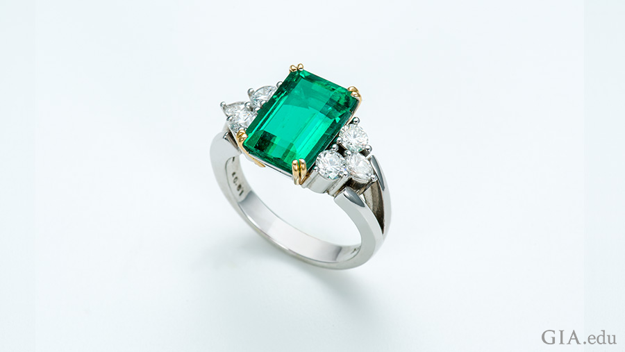
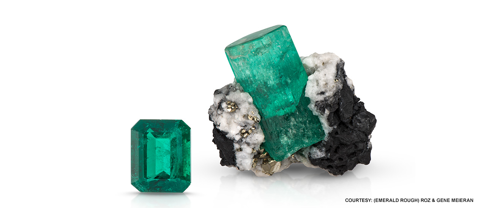

BIRTHSTONES

{# May Birthstone : Emerald}

{}

Need caption

{For thousands of years, emerald has evoked rebirth and renewal. emerald is the 
perfect color for spring.} From the poetic description of Ireland as “the 
Emerald Isle” to the vibrant green of the famed gemstone itself—the May 
birthstone emerald has captured hearts and minds through the ages.

{The variations of this rich green color suggest lush gardens. According to 
legend, emerald has the power to make its wearer more intelligent and 
quick-witted, and it was once thought to cure diseases like Malaria. The 
gemstones are given for the 20th and 35th wedding anniversaries.}

Emerald Birthstone
{## Emerald Birthstone Meaning & History}

{}

{From Egyptian pharaohs to Inca emperors, emerald has enchanted royalty. 
Cleopatra used emerald in her adornments. The Crown of the Andes was created in 
colonial South America.}, is one example of how the Spanish revered the May 
birthstone. Francisco Pizarro took the largest stone from the last emperor, 
Atahualpa, according to lore. Emeralds, among them was a gold rosary necklace 
with a cross made of seven emeralds and gold treasures recovered from the 
sunken 17th century Spanish galleon Nuestra Seora de Atocha represent a small 
fraction of the colonial wealth sent to Spain from the New World.

The Crown of the Andes boasts the May birthstone with a 24 carat emerald center 
stone and 442 additional emeralds set in the intricately crafted golden 
headpiece.
The Crown of the Andes boasts an impressive 24 ct emerald center stone and 442 
additional emeralds set in the intricately crafted golden headpiece. Photo: the 
Metropolitan Museum of Art

{The May birthstone is the focal point of a gold rosary necklace with a cross 
made of seven emeralds, recovered from the Nuestra Señora de Atocha shipwreck, 
represent a small fraction of the colonial wealth sent to Spain from the New 
World.}

An emerald cross and gold rosary recovered from the Nuestra Señora de Atocha 
shipwreck. Courtesy: Eileen Weatherbee. Photo: Robert Weldon/GIA

{The word "Emerald" comes from the ancient Greek word smaragdos, a green gem.} 
Roman author Pliny the Elder, who died in the 79 CE eruption of Mt. Vesuvius, 
wrote in his encyclopedic Natural History that “nothing greens greener.” He 
also stated that the May birthstone had therapeutic properties that helped gem 
cutters: “(they) have no better method of restoring their eyes than by 
looking at the emerald, its soft, green color comforting and removing their 
weariness and lassitude.” {Science shows that the color green relieves stress 
and eye strain.}

{The green birthstone was thought to have powers. By placing it under the 
tongue, one could be see into the future. It made one an eloquent speaker and 
exposed lovers who made false promises.}

{## Where Are Emeralds Found?}

{The best emeralds have been from the source of Colombia for more than 500 
years.} Three mining sites in Colombia are particularly noteworthy: Muzo, 
Chivor and Coscuez. Each locality produces a range of colors but, generally 
speaking, darker tones of pure green emeralds come from Muzo. Emeralds that are 
lighter in tone and slightly bluish green are associated with Chivor. Slightly 
yellowish green emeralds are unearthed in Coscuez.

The May birthstone, emerald, is found in the landscape of the lush green Andes 
Mountains towering over the deep tropical valleys around Muzo.
The lush green Andes Mountains tower over the deep tropical valleys around 
Muzo. Photo: Robert Weldon/GIA

{Emeralds are also found in the state of Minas Gerais, Brazil.} One of the most 
productive sites for the green birthstone is the sophisticated Belmont mine. 
Capoeirana is another important locality, a rugged region worked largely by 
independent miners and small-scale operations.

Miner holding a rough emerald at the Capoeirana mining area where the May 
birthstone is found.
An independent miner at the Capoeirana mining area holds a rough emerald. 
Photo: Eric Welch/GIA

{The May birthstone can also be found in Zambia, Africa.} Zambia is a major 
source, and mines in the Ndola Rural Restricted Area are known for producing 
emeralds that are bluish green and darker in tone. Pakistan and Afghanistan are 
important producers as well.

{## Emerald Birthstone Care & Cleaning}

{Emerald is more susceptible to scratching than a diamond because it is a 7.5 
to 8 on the Mohs scale.}, which ranks 10 on the scale. The May birthstone is 
often treated to improve its color or clarity. Common treatment methods include:

1. Dyeing: Paler emeralds with multiple fractures may be dyed green to enhance 
their color.
2. Fracture Filling: Oils, waxes, and artificial resins are often used to fill 
surface-reaching fractures in emeralds. The goal is to reduce the visibility of 
the fractures and improve the apparent clarity. The volume of filler material 
present can range from minor to significant; the different substances have 
varying degrees of stability.

The emerald birthstone requires some special care: Avoid exposure to heat, 
changes in air pressure (such as in an airline cabin) and harsh chemicals. 
Never put an emerald in an ultrasonic cleaner, as the vibrations and heat can 
cause the filler to sweat out of fractures. Filled emeralds can also be damaged 
by exposure to hot water used for washing dishes. {The safest way to clean 
emeralds is to use a soft brush and soapy water.}

3.69 carat emerald ring flanked by six diamonds shows off the May birthstone.
The beauty of emerald is seen in this 3.69 ct stone flanked by six diamonds. 
Photo: Robert Weldon/GIA. Courtesy: Ismael Daoud

The May birthstone is perfectly suited to the celebration of life blooming 
everywhere. Given the rich green hues of emerald, it was inevitable that we 
would fall under its spell. Productive mines around the world ensure that all 
who love green or are born in May will continue to be enchanted. Now you can 
treat yourself – or a loved one – to an emerald that captures the 
exuberance of the season. Learn more about how to pick a beautiful emerald with 
our Emerald Buying Guide.
More about Emerald Emerald Buyer's Guide

Interested in exploring additional birthstones?

(+)
{[Source](https://www.gia.edu/birthstones/may-birthstones)}
