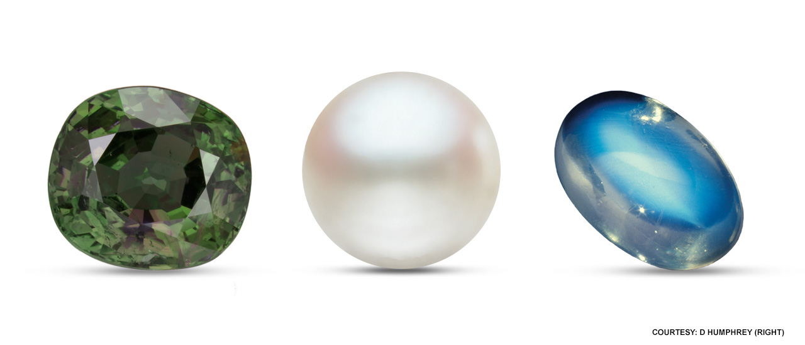
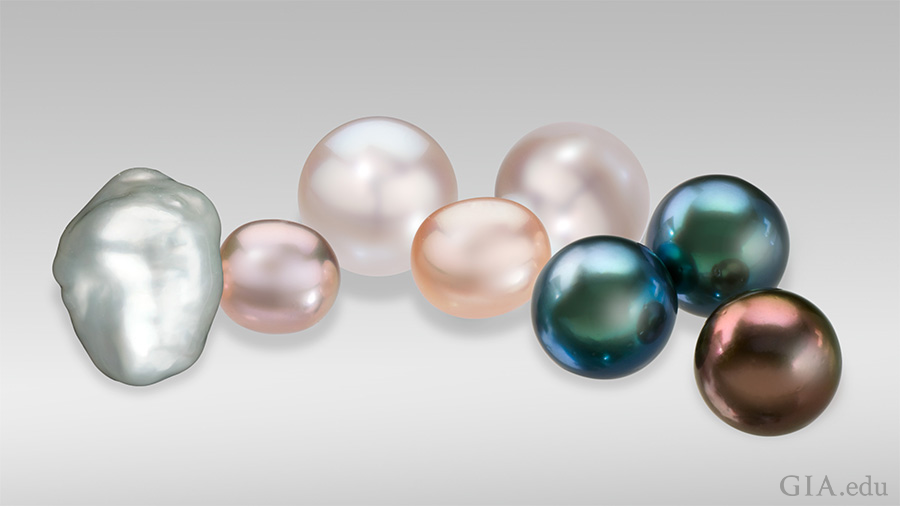
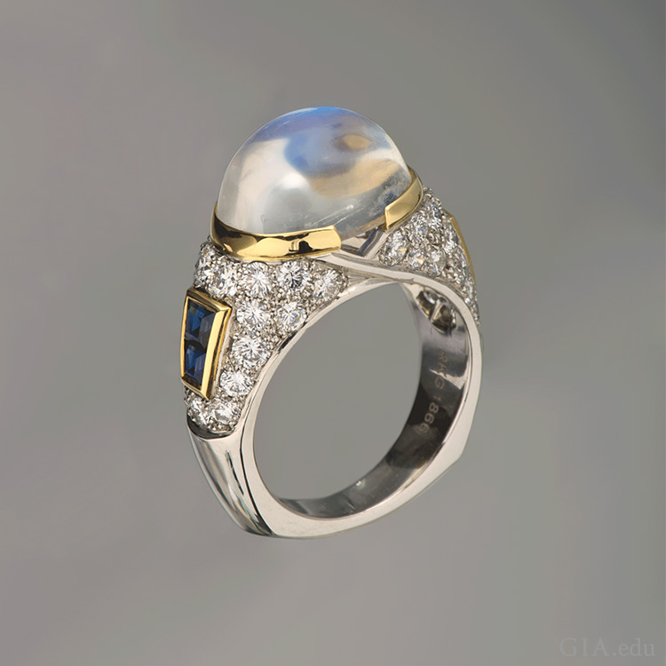

Save Page as PDF File
{[Source](https://www.gia.edu/birthstones/june-birthstones)}
BIRTHSTONES

{# June Birthstones : Alexandrite, Pearl, Moonstone}
{}

June Birthstone  Alexandrite Pearl Moonstone

{If you were born in the month of June, you will have three of your own.} June 
is one of only three months (the others are August and December) that has three 
birthstones, giving you a variety of beautiful birthstone choices.

The June birthstones are pearl, alexandrite and moonstone. With so many 
attractive options, individuals with June birthdays can have a birthstone that 
fits their mood or budget, due to the different colors and price points these 
gems offer.
Jump To:
Pearl Moonstone Alexandrite

Pearl Birthstone
{## Pearl Birthstone Meaning & History}
{}

{The Pearl birthstone is from oceans, lakes and rivers. It is a wardrobe staple 
that women of all ages love. Our forebears were fascinated by the origin of 
pearls. Pearls were thought to be from heaven. The Chinese believed that this 
June birthstone came from the brain of a dragon.} Christopher Columbus and his 
contemporaries thought that mollusks formed pearls from dew drops.

{Pearls are gems that grow inside a living saltwater or freshwater mollusk 
(either an oyster or a mussel).} Natural pearls form when the mollusk secretes 
a substance called nacre around an irritant such as a piece of sand or a 
parasite that has invaded its shell. Cultured pearls are a product of human 
intervention. Technicians implant a piece of mantle tissue alone (common for 
freshwater cultured pearls) or with a mother-of-pearl shell bead (all 
saltwater) into a host mollusk. The mollusk covers the irritant with nacre, 
just like a natural pearl. {Cultured pearls are raised in saltwater or 
freshwater pearl farms where the mollusks are cleaned and protected from 
predators. There are a variety of sizes, colors and shapes of cultured pearls.} Thousands of years of pearl fishing have decimated the natural 
pearl beds, so cultured pearls account for the vast majority of pearl sales 
today. 

{*Pearls have long been associated with purity, humility and innocence.* So, traditionally pearls were a wedding gift.} 
So it may be said that the June birthstone meaning is "sweet simplicity." 

The pearl birthstone was also thought to have beneficial properties. {Pearls 
were said to bring long life and prosperity in the ancient Sanskrit text. In 
Asia, Pearls were believed to cure indigestion and hemorrhages. The 19th 
century Arab physicians claimed that pearl powder alleviated depression and 
improved eyesight.}

One of the most famous natural pearls is the 50.56 carat (ct) La Peregrina. 
About the size of a pigeon’s egg, the drop shaped pearl was discovered in the 
1500s in the Gulf of Panama. It became a prized possession of European royalty. 
Richard Burton eventually gifted it to Elizabeth Taylor in 1969; Christie’s 
New York auctioned the Cartier necklace containing La Peregrina for $11.8 
million in 2011.

Elizabeth Taylor’s historic 50.56 carat La Peregrina Pearl prominently 
features the June birthstone in a pendant to a two-strand pearl, ruby, and 
diamond necklace.
Cartier set Elizabeth Taylor’s historic 50.56 ct La Peregrina pearl as part 
of the pendant to this two-strand pearl, ruby and diamond necklace. Courtesy: 
Christie's

{## Where are Pearls Found?}

Warm waters… clear skies… dramatic scenery – it sounds like a dream beach 
vacation, don’t you think? It’s also an accurate description of where 
you'll often find these pearl birthstones. Pearl-bearing mollusks fail to 
thrive in polluted waters, so pearl farms are usually located far from 
civilization – and often in breathtaking settings.

{In Japan, China, Australia, Indonesia, Philippines and the southern coast of 
Southeast Asia are some of the places where saltwater cultured pearls are 
grown.} Akoya cultured pearl farms are primarily found in Japan and China, 
especially along the southern coasts of Guangdong and Guangxi provinces. South 
Sea cultured pearls are farmed from the northern coast of Australia through 
Indonesia to the southern coast of Southeast Asia, with large operations in the 
Philippines as well. The Gambier Islands and the Tuamotu Archipelago, both part 
of French Polynesia, are two locales where the rich black Tahitian pearls are 
cultured. {China is the dominant source of freshwater cultured pearls.}

The June birthstone is found in this ocean landscape with boats docked on shore 
in Ago Bay, Japan an important site for akoya cultured pearl farms.
Ago Bay, Japan is one of the most important sites for akoya cultured pearl 
farms. Photo: Valerie Power/GIA

Landscape of French Polynesia's atolls shielding pearl farms, where the June 
birthstone is found, from surrounding ocean waves. The land is lined with palm 
trees, sheltering a lagoon that's ideal for mollusk culturing.

French Polynesia's atolls shield pearl farms from the surrounding ocean waves. 
Behind the fringe of palm trees, there's a sheltered lagoon that's ideal for 
mollusk culturing. Photo: Amanda Luke/GIA

{While Natural pearls were found in the Arabian Gulf for at least 5,000 years, 
divers have been recovering the June birthstone from the Red Sea since 300 BC. 
Pearls have been provided by the Strait of Mannar since 2000. Large quantities 
of pearls were recovered from the waters off Mexico, Central America and 
Venezuela during the 16th century. There are only a small amount of pearls in 
these areas today.}

{## Pearl Birthstone Care & Cleaning}

{At 2.5 to 3.0 on the Mohs Scale of hardness, pearls are soft and need special 
care. They should be kept separate from other gemstones and metal jewelry. 
Plastic can emit a chemical that will damage the pearl's surface, so never 
store it in a plastic bag. Apply makeup, hair products, and perfume, before 
putting on jewelry.}

{The best way to clean your June birthstone is to use a soft, damp cloth after 
each time the pearls are worn.}

A baroque cultured pearl, small fancy pink and peach off-round freshwater 
cultured pearls, round white Australian cultured pearls, and black and brown 
Tahitian cultured pearls display the variety of the June birthstone.

Today, cultured pearls can be found in a wide variety of shapes, colors and 
sizes (here, measuring between 9 mm and 23 mm). From left to right: a baroque 
cultured pearl; small fancy pink and peach off-round freshwater cultured 
pearls; round white Australian cultured pearls; and black and brown Tahitian 
cultured pearls. Photo: Robert Weldon/GIA.

Now that you know a little more about the history of pearls and where this June 
Birthstone comes from, you probably have a deeper appreciation for these 
classic beauties! If we’ve whetted your appetite for the pearl birthstone, 
consider adding five essential pearl jewelry pieces to your collection. But 
before you begin shopping for pearls, be sure to learn about the GIA 7 Pearl 
Value Factors™ and what to look for with this handy Pearl Buying Guide.
More about Pearl Pearl Buyer's Guide

Moonstone Birthstone
{## Moonstone Birthstone Meaning & History}
{}

Moonstone is the best-known gem of the feldspar group of minerals. {Moonstone 
is 
renowned for its adularescence, the light that appears to billow across a 
gemstone, giving it a special glow. The finest moonstones show a blue sheen 
against a colorless background. This June birthstone has been associated with 
both the Roman and Greek lunar deities. Hindu mythology claims that it is made 
of solidified moonbeams.} 

{*Moonstone is often associated with love, passion and 
fertility; it is believed to bring great luck.*}

Great designers of the Art Nouveau era (1890s–1910s), such as René Lalique 
and Louis Comfort Tiffany, featured moonstone in their fine jewelry. The 
moonstone birthstone came to the forefront again during the 1960s “flower 
child” movement and with New Age designers of the 1990s.

The June birthstone is featured in a Frankish disk brooch from the second half 
7th century made of gold sheet, filigree, moonstone, glass cabochons, garnets, 
mother-of-pearl, and moonstone.

Frankish disk brooch from the second half 7th century. Medium: Gold sheet, 
filigree, moonstone/adularia, glass cabochons, garnets, mother-of-pearl, and 
moonstone. Courtesy: The Metropolitan Museum of Art

{## Where is Moonstone Found?}

Moonstone can be found in a wide variety of places. {India and Sri Lanka are 
the most important world locations for the moonstone. Moonstone can be found in 
parts of the United States,  Brazil, Madagascar, Myanmar and Tanzania. }

Miners in Sri Lanka are using water to sift through rocks to find moonstone, 
the June birthstone.
Mining for moonstone in Sri Lanaka. Photo: Afsaneh Tazari/GIA

Hand holding pile of rough moonstone, the June birthstone, found in Sri Lanka.
Rough moonstone found in Sri Lanka. Photo: Vincent Pardieu

{## Moonstone Birthstone Care & Cleaning}

{Moonstone has mild toughness and is a 6 on the Mohs scale. It may crack under 
high heat. Ultrasonic and steam cleaners shouldn't be used on your moonstone. 
Warm soapy water with a soft brush is the best way to clean it.}

A platinum ring boasts the June birthstone, an 8.34 carat moonstone set with 
sapphires.

The 8.34 ct moonstone in this ring designed by Maria Canale is set in platinum 
with sapphires. Courtesy: Richard Krementz Gemstones. Photo: Robert Weldon/GIA
More about Moonstone Moonstone Buyer's Guide

Alexandrite Birthstone
{## Alexandrite Birthstone Meaning & History}
{}

Alexandrite is the rare variety of the mineral chrysoberyl that changes color 
in different lighting. {The alexandrite birthstones show a vivid green to 
bluish green in daylight or fluorescent light, and an intense red to purplish 
red in the same light.} Major alexandrite deposits were first discovered in 
1830 in Russia’s Ural Mountains. 

{Alexandrite was named after the young Alexander II (1818–1881), the heir 
apparent to the Russian throne. The country was interested in the resemblance 
of the red and green colors to the military colors of Russia.}

When certain types of long, thin inclusions are oriented parallel to each other 
in this June birthstone, they can create another phenomenon, called chatoyancy 
or the cat’s-eye effect. Few gems are as fascinating – or as stunning – 
as cat’s-eye alexandrite.

The June birthstone, a 7.19 carat alexandrite from the Tunduru region of 
Tanzania appears green in flourescent light and purple in incandescent 
illumination.

This 7.19-ct alexandrite (as it appears in fluorescent, left, and incandescent, 
right, illumination) is from the Tunduru region of Tanzania. Photo: Robert 
Weldon/GIA

{## Where is Alexandrite Found?}

{Alexandrite comes from Brazil, Sri Lanka and East Africa. The Ural Mountain 
deposits were eventually mined out.}

{The newer deposits contain some fine-quality stones, but they are not as bright as the 19th century Russian Alexandrites.}

{Because of scarcity, fine-quality Alexandrite is one of the more expensive 
colored gems.}

Landscape of a carved out mining ditch with a small stream running through, 
surrounded by tree-covered mountains in Brazil where the June birthstone, 
alexandrite, is found.
Chrysoberyl mining at corrego do Fogo near Malacacheta, Brazil. Courtesy: ICA

{## Alexandrite Birthstone Care & Cleaning}

{This June birthstone is relatively hard—8.5 on the Mohs scale. It has 
excellent toughness and no cleavage, which is a tendency to break when struck. 
This makes it a good choice for rings and other mountings subject to daily 
wear.}

{It is relatively hard—8.5 on the Mohs scale. It has excellent toughness and 
no cleavage. It's a good choice for rings and other mountings that are subject 
to daily wear.}

An alexandrite engagement ring would be a unique gift for a bride-to-be 
born in June. Although 

{It is best to clean it in warm, soapy water, ultrasonic and steam cleaners are 
usually safe to use to clean your June birthstone.}

The June birthstone is prominent in a 5.16 carat oval alexandrite ring 
surrounded by brilliant round diamonds and alexandrites set in platinum.
Alexandrite and diamond ring handcrafted with a 5.16 carat oval alexandrite 
center stone accented with 0.57 carats of round alexandrites and 0.74 carats of 
brilliant diamond rounds set in platinum. RO1005-ALOV - Platinum, Alexandrite, 
Oval, 5.16ct. Courtesy: Omi Privé

June is a month for celebrations, be it weddings, anniversaries, graduations or 
birthdays. And what better way to celebrate than with a June birthstone. Those 
who were born in June are lucky to have three gorgeous birthstones to choose 
from. Now you know how to pick one of these June birthstones for yourself or a 
loved one born in the month of June.
More about Alexandrite Alexandrite Buyer's Guide

Interested in exploring additional birthstones?

(+)
