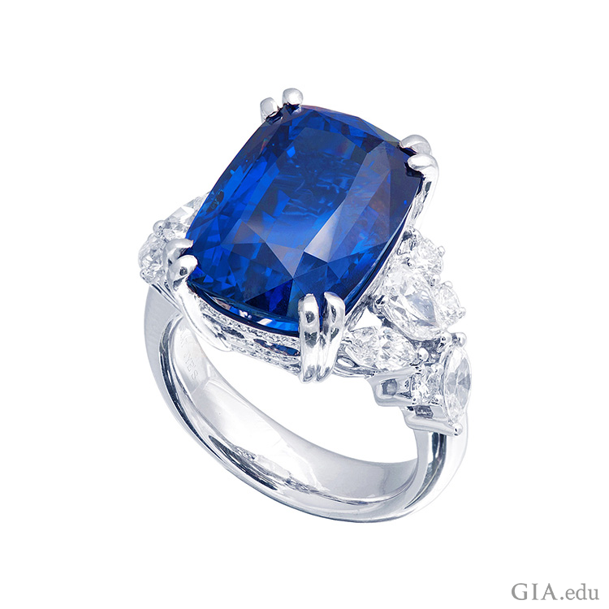
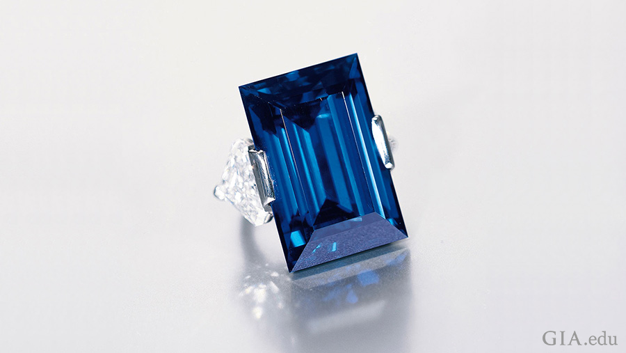

{[Source](https://www.gia.edu/birthstones/september-birthstones)}
BIRTHSTONES
September Birthstone

{# September Birthstone : Sapphire}
{}

The September birthstone is sapphire – a gem that’s been cherished for 
thousands of years. {The term sapphire usually refers to the blue variety of 
corundum. This birthstone comes in a rainbow of other colors.} Sapphires have 
been long associated with royalty and romance and are also said to symbolize 
fidelity and the soul. {“Sapphire” from the Greek word sappheiros. Blue 
sapphires is one of the most popular colored stones.} Read on to learn more 
about the September birthstone, specifically its history and where it can be 
found.

Sapphire Birthstone
{## Sapphire Birthstone Meaning & History}

{The September birthstone has been associated with honesty, sincerity, 
faithfulness and nobility. For centuries, the robes of the clergy and royalty 
have been adorned with sapphires.} The elite of ancient Greece and Rome 
believed that blue sapphires protected their owners from harm and envy. Clerics 
of the Middle Ages wore sapphires because they symbolized Heaven. {Ancient 
Persians believed the earth rested on a giant sapphire, which made the sky 
blue.}

{The September birthstone was thought to have healing powers.} Medieval 
Europeans believed that sapphire cured plague boils and diseases of the eye. 
{Sapphire was also thought to be an antidote to poison.}

Famous sapphires include the Rockefeller Sapphire, a 62.02 carat (ct) 
rectangular step cut stone that was unearthed in Myanmar (Burma). Acquired in 
1934 by financier and philanthropist John D. Rockefeller, Jr. (1874–1960) 
from an Indian maharaja, the gem was recut and remounted over the years. The 
sapphire was first set as a brooch and later as a ring featuring two 
cut-cornered triangular diamond side stones. Perhaps the best-known sapphire in 
recent years is the 12 ct blue gem surrounded by diamonds in the sapphire 
engagement ring first worn by Princess Diana and then given by her son to Kate 
Middleton, now Duchess of Cambridge.

The famed Rockefeller Sapphire weighs 62.02 carats and is flanked by two 
cut-cornered triangular cut diamonds, mounted in a platinum ring to show off 
the blue September birthstone.

The famed Rockefeller Sapphire weighs 62.02 ct. Here it is flanked by two 
cut-cornered triangular cut diamonds, mounted in a platinum ring signed Tiffany 
& Co. Courtesy: Christie’s Images Ltd., 2015

In addition to being the September birthstone, sapphire is also the gem 
commemorating the 5th and 45th wedding anniversaries.
{## Where Is Sapphire Found?}

{Three important sources are Kashmir, Myanmar and Sri Lanka.} for the September 
birthstone. Significant quantities of the September birthstone have {Sapphire 
is also found in Australia, Thailand, Cambodia, United States, and other 
countries of Africa.}

{The sapphires were discovered in Kashmir in the late 19th century. The 
Himalayas exposed a large pocket of blue crystals.} As the spectacular 
sapphires began to appear farther south, the Maharaja of Kashmir – and his 
army – took control of the new locality. From 1882 to 1887, thousands of 
large, beautiful crystals were recovered. The stones faceted from these 
crystals established Kashmir sapphire’s reputation as one of the world’s 
most coveted gems. Production has been sporadic since then, but auction houses 
occasionally sell fine pieces of Kashmir sapphire jewelry.

{The September birthstone is also produced in the Mogok area of Myanmar.} 
Jungle-clad hills hemmed by mountains make a dramatic landscape. Sapphire 
typically occurs alongside ruby deposits, but in much smaller quantities than 
its red counterpart. ”Burmese” sapphire, as it is still called by many, can 
possess a rich, intense blue hue, which has made it particularly prized. 
Myanmar is also a noted source of jadeite jade, spinel, zircon, amethyst, 
peridot and other fine gem materials.

A scenic view of the lush green hills near Mogok rivals the beauty of the 
sapphires, September’s birthstone, that are hidden underground.
A scenic view near Mogok rivals the beauty of the sapphires hidden underground. 
Photo: James E. Shigley/GIA

{The September birthstone has been found in Sri Lanka for more than 2,000 
years.} The blue and fancy-color stones mined from the alluvial gravels of this 
“jewel box of the Indian Ocean” can display remarkable brilliance and 
saturation. In addition, the island’s milky white “geuda” sapphires can 
be heat treated to a rich blue color.

Miner in Sri Lanka searching for September’s birthstone, sapphire, among 
gravel using rudimentary washing techniques in a local stream.
Using the same rudimentary washing techniques as generations before them in Sri 
Lanka, a miner is searching for sapphire among the gravels in a local stream. 
Courtesy: Afsaneh Tazari

Thailand is both a source of sapphire and a major cutting and treatment center. 
In dense jungle crossed by dirt roads, miners dig for sapphire in Chanthaburi 
Province. Sapphires from Myanmar and Cambodia often end up in Chanthaburi for 
cutting and treatment and are also sent to Bangkok, an important gem hub.

{## Sapphire Birthstone Care & Cleaning}

{}

{The September birthstone is hard, ranking 9 on the Mohs scale. It has good 
strength.} and no cleavage, which is a tendency to break when struck. {It's a 
great choice for rings and other mountings that are subject to daily wear.}

Note, though, that sapphires are often treated to improve their color or 
clarity. Heat treatment is common – and the results permanent – so it is 
well accepted in the trade. Less common treatments such as lattice diffusion, 
fracture filling and dyeing may require special care. In some cases, the color 
induced by lattice diffusion is so shallow it could be removed if the stone was 
chipped or had to be recut. Fracture-filled and dyed sapphires can be damaged 
by even mild acids like lemon juice. Before you buy a sapphire, always ask if 
it is treated and by what method.

{Warm, soapy water is the best choice for cleaning the September birthstone. 
Ultrasonic and steam cleaners are usually safe for treated stones.} 
Fracture-filled or dyed material should only be cleaned with a damp cloth.

A rich blue sapphire set in a ring with diamonds shows off the September 
birthstone. It’s easy to love the rich blue of the September birthstone, 
sapphire. Courtesy: JYE's International

Now that you know all about sapphire, take a look at our Sapphire Buying Guide, 
as it can help you pick a stunning September birthstone for yourself or a loved 
one. More about Sapphire Sapphire Buyer's Guide

Interested in exploring additional birthstones?

(+)
