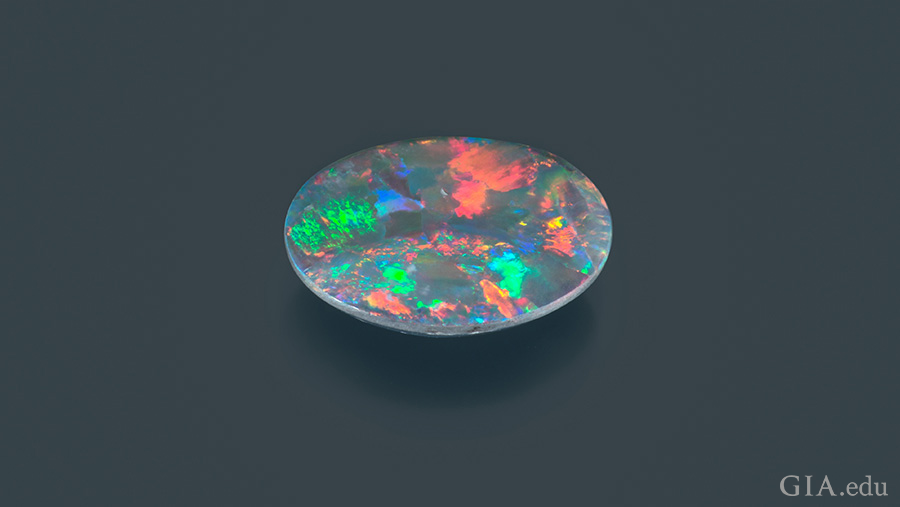
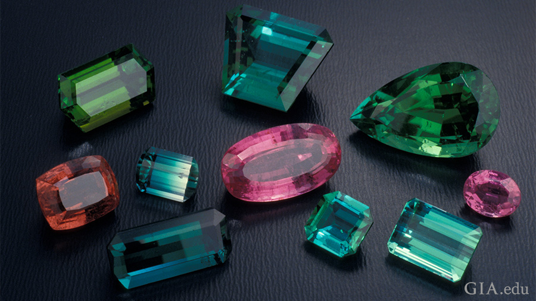
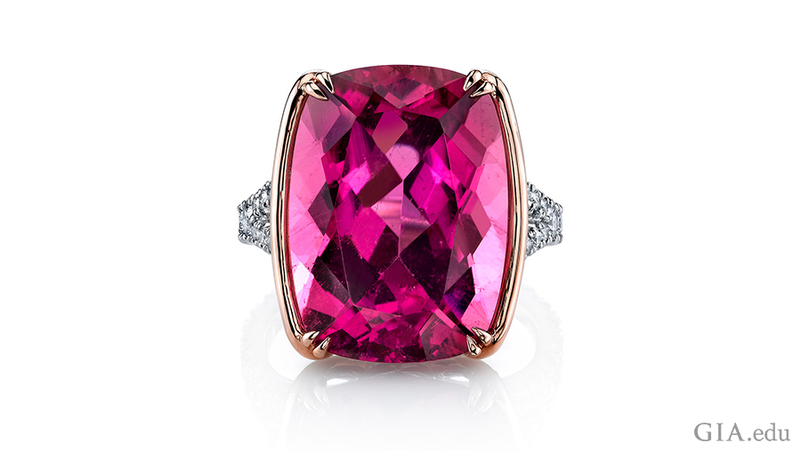

{[Source](https://www.gia.edu/birthstones/october-birthstones)}
BIRTHSTONES
October Birthstone
October Birthstones Opal Tourmaline

{}

Those born in October enjoy two spectacular birthstones to commemorate their 
birthdays – opal and tourmaline. {Both October birthstones have beautiful coloring characteristics.} Learn more about these two 
October birthstones and discover the perfect gift for those born in the tenth 
month.
Jump To:
Opal Tourmaline

Opal Birthstone
{## Opal Birthstone Meaning & History}
{}

The name of this, the traditional October birthstone, is believed to have 
originated in India (the source of the first opals brought to the Western 
world), where in Sanskrit it was called upala, a “precious stone." .” In 
ancient Rome, this became opalus. Most opals are valued for their shifting 
colors in rainbow hues – a phenomenon known as “play-of-color.”
{The name of this, the traditional October birthstone, is believed to have originated in India, where it was called upala, a "precious stone." Opalus in Rome. The phenomenon of play-of-color is what makes most opals worth their weight in gold.}
The October birthstone’s dramatic play-of-color has inspired writers to 
compare it to fireworks, galaxies and volcanoes. Bedouins once believed opal 
held lightning and fell from the sky during thunderstorms. {The ancient Greeks believed that the gift of prophesy and protection from disease was bestowed by opals. Europeans have maintained that opal is a symbol of purity, hope and truth. The virtues and powers of all colored stones were thought to have been embodied by opal.}

Opal is also the stone given to celebrate the 14th wedding anniversary.
Specks of pink, green, blue, and orange are found on the colorful 1.72 carat 
October birthstone, opal.
A breathtaking sunset seems to dance on the surface of this 1.72 carat (ct) 
opal. Photo: Dr. Edward J. Gübelin/GIA
{## Where Is Opal Found?}

{}
{}

{The fields of Australia are the most productive in the world for opal. Ethiopia, Mexico and Brazil are important sources. There are additional deposits in the United States.}

Lightning Ridge, a small town in New South Wales, Australia, is famed for 
producing prized black opal. A dry and rocky region softened only by small 
trees and scrub brush, Lightning Ridge gets little rain and bakes in the 
scorching summer temperatures. The climate is so unforgiving that miners often 
live underground to find respite from the punishing heat.
Light shines on the surface of the Lightning Ridge mine where the October 
birthstone is found, revealing black opal nodules in a line.
Black opal nodules are sometimes found in a line, as you can see in this photo 
from the Lightning Ridge mine. Photo: Vincent Pardieu

Australia is also a source of other types of the October birthstone. White opal 
is found in the White Cliffs area of New South Wales, as well as in Mintabie, 
Andamooka and Coober Pedy in South Australia. Boulder opal, which comes from 
only one location in the world, is mined in Queensland.
Two pieces of boulder opal from Queensland reveal the bright rainbow colors of 
the October birthstone.
Two pieces of boulder opal that is found only in Queensland. Photo: Robert 
Weldon/GIA

In Ethiopia, the October birthstone is found near the village of Wegel Tena, in 
Wollo Province. Travel 340 miles (about 550 kilometers) north of the capital 
Addis Ababa and up 8,000 feet (2,400 meters), where miners pry opal from shafts 
dug into the side of a plateau. Gems unearthed here range in body color from 
white, yellow, orange and brownish red to “chocolate” brown. Some of the 
opals show play-of-color. Another mine, in Ethiopia’s Shewa Province, yields 
the coveted black opal, as well as orange, white and crystal opal. Its 
treasures are buried in steep cliffs that tower over the landscape. 

Querétero, a state in Mexico, is known for producing fire opal in yellow, 
orange and reddish orange to red, some with good play-of-color. The mines are a 
tourist destination, and getting to them requires taking a dirt road through 
dense forests of pine and oak, past scrubby plateaus of cacti and shrubs, and 
up winding mountain roads.

{## Opal Birthstone Care & Cleaning}

{}

Opal may be treated by impregnation with oil, wax or plastic. Opal doublets or 
triplets are fine slices of opal glued to a base material and covered with a 
thin dome of clear quartz. {Warm, soapy water is the safest way to clean this October birthstone. The cleaning methods might damage the material. Long term exposure to water may affect the bond between doublets and triplets. If there is high heat or sudden temperature changes, natural opal can break.}

This October birthstone ranges from 5 to 6.5 on the Mohs scale of hardness. To 
prevent jewelry set with harder gems from scratching opal, store it by itself. 
Diamonds, rubies, sapphires, and emeralds are just a few of the gems that can 
scratch the October birthstone. 
Sapphires and diamonds encircle the October birthstone, a 1.92 carat black opal 
in a stunning 18K yellow gold and black rhodium ring.
Sapphires and diamonds encircle a 1.92 carat (ct) black opal in this stunning 
18K yellow gold and black rhodium ring. Courtesy: Omi Privé
More about Opal Opal Buyer's Guide

Tourmaline Birthstone
{## Tourmaline Birthstone Meaning & History}

{}

Tourmaline is the newer October birthstone. {The name Tourmaline comes from the Sinhalese 
word toramalli, meaning "stone with many colors".}, because it often has 
multiple colors in one crystal. Very few gems match tourmaline’s dazzling 
array of colors. Perhaps this is why ancient mystics believed this October 
birthstone could inspire artistic expression – it has a color palette for 
every mood. {The pink and red rubellites, emerald green "chrome" tourmalines, and neon green and blue-to-violet "paraba" Tourmalines are some of the most popular.} 

{Tourmaline was often mistaken for other gemstones because of its wide range of colors.} One of the “rubies” in the Russian crown jewels, the 
“Caesar’s Ruby” pendant, is actually red (rubellite) tourmaline. A 
Spanish conquistador found green tourmaline crystals in Brazil in the 1500s and 
confused the stones with emerald. These and other cases of mistaken identity 
continued for centuries until scientists recognized tourmaline as a distinct 
mineral species in the 1800s.
Blue, green, pink, and orange tourmaline in different cuts display the 
multi-colors found in the October birthstone.
Suite of multi-color tourmaline. Photo: Robert Weldon/GIA

Different colors of tourmaline are thought to have their own healing 
properties. Black tourmaline is believed to protect the wearer and give a sense 
of self-confidence. Pink tourmaline embodies love and is associated with 
compassion and gentleness. Green tourmaline promotes courage, strength and 
stamina. Tourmaline is given to celebrate the eighth wedding anniversary.

{## Where Is Tourmaline Found?}

{}
{}

{In addition to Brazil, tourmaline is also found in Afghanistan, Pakistan, Nepal, and other countries in Africa. In the United States, California and Maine are important producers of fine tourmaline.} Hands holding purple and green tourmaline rough while visiting the deposit of 
the October birthstone, near Mavuco village in Mozambique.
Examining purple and green tourmaline rough while visiting the tourmaline 
deposit near Mavuco village on a field expedition to Mozambique. Photo: Vincent 
Pardieu

Most of the tourmaline mined in Brazil over the centuries comes from pegmatites 
in the state of Minas Gerais. These subterranean intrusions of magma are the 
source of a virtual kaleidoscope of gem minerals. In the late 1980s, however, 
electric green, blue and violet tourmalines entered the gem market from 
pegmatites in Brazil’s Paraíba State. Scientists found that the intense 
colors were caused by trace amounts of copper, which had previously not been 
recorded as a coloring agent in any other tourmaline. In the early 2000s, 
Paraíba-type copper-bearing tourmalines were also discovered in Mozambique and 
Nigeria. Overall, prices for the best Paraíba and Paraíba-type tourmalines 
easily surpass other tourmalines due to their vivid hues, higher color 
saturation and greater rarity.
Landscape featuring an old tunnel entrance in a rocky mountain at the 
Tourmaline King mine where the October birthstone is found.
Old tunnel entrance at the Tourmaline King mine. Photo: Brendan Laurs

In the United States, both Southern California and Maine host several pegmatite 
districts. For more than a century, they have sporadically yielded large 
quantities of tourmaline.

Maine’s first major tourmaline deposit was discovered in 1820 at Mount Mica 
in Paris, by two young boys exploring the local area. Even today, a quarry at 
Mount Mica intermittently produces various colors of gem tourmaline. The Dunton 
mine, near Plumbago Mountain, is the most prolific producer of tourmaline in 
Maine. 

In 1898, California’s first commercial tourmaline mine opened at the Himalaya 
pegmatite in the Mesa Grande district – famed for the production of fine 
rubellite. To feed Empress Dowager Cixi’s obsession with the vibrant color, 
San Diego mines sent 120 tons of gem rubellite to Imperial China between 1902 
and 1910. With the death of Cixi in 1908 and the subsequent overthrow of the 
Qing dynasty, the heyday of tourmaline mining in California ended. Today, only 
a few mines in San Diego County occasionally produce gem-quality tourmaline.

{## Tourmaline Birthstone Care & Cleaning}

{}

{The birthstone is generally suitable for everyday wear and has a rating of 7 to 7.5 on the Mohs scale. These gems are stable enough to resist light and most chemicals, but can be damaged by heat.} 
{The best way to clean this October's birthstone is with warm soapy water and a soft brush. Ultrasonic and steam cleaners are not recommended.}A 15.16 carat pink tourmaline and diamond ring set in platinum and white gold 
boasts the October birthstone.
15.16 ct pink tourmaline and diamond ring set in platinum and white gold. 
Courtesy: Omi Privé

Now that you know a little bit more about the history of these two October 
birthstones and where they can be found, you just might be inspired to add them 
to your collection! But before you go shopping for an October birthstone, be 
sure to review our Opal Buying Guide and our Tourmaline Buying Guide for tips 
to help you pick a beautiful October birthstone. Both of these birthstones come 
in a spectacular array of colors sure to please you or your loved one born in 
October.
More about Tourmaline Tourmaline Buyer's Guide

Interested in exploring additional birthstones?

(+)
